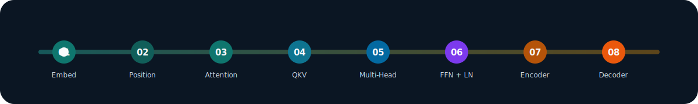

<p align="center">
  
</p>

<p align="center">
  
  
  
</p>

# Transformer From Scratch

A hands-on repository for understanding Transformer building blocks step by step.

> Read shapes. Run tasks. Build intuition.

This project is complete through 8 phases, from embeddings all the way to decoder concepts.

<p align="center">
  
</p>

## Two Ways To Use This Repo

This same codebase can support two audiences without major code changes.

### Version 1: Student Learning Track

Use this repo as a guided lab notebook for learning Transformers from first principles.

What makes it useful for students:

- Each phase is small and focused on one idea at a time.
- Tasks are split into manageable files so you can learn concept by concept.
- `observations.md` files help connect code, tensor shapes, and intuition.
- The repo encourages shape-first debugging, which is one of the best ways to understand attention.

How students can get help from this repo during their learning journey:

1. Start from `experiments/phase_01_embeddings` and move in order.
2. Run one task at a time and inspect the printed output carefully.
3. Read the matching `observations.md` after running the code.
4. Focus on three questions in every phase: input shape, output shape, and why the transformation matters.
5. If you get confused, compare the current phase with the previous one and identify what new idea was added.
6. If you get stuck, use the repo as a checkpoint system: read the task file, run it, read `observations.md`, then rewrite the concept in your own words.
7. Re-run earlier phases after finishing later ones. Concepts like Q, K, V and masking make more sense on the second pass.

<details>
<summary><strong>Student Help Map</strong></summary>

<br />

| If you need help with... | Go here first |
|---|---|
| Understanding the code step | `task_*.py` |
| Understanding the concept | `observations.md` |
| Understanding tensor dimensions | `utils/shapes.md` |
| Seeing the overall sequence | `roadmap.txt` |
| Checking how far the repo goes | `logs/progress.md` |

</details>

Suggested student workflow:

- Read one task file.
- Predict the output shape before running it.
- Run the file.
- Check whether your prediction was correct.
- Read the phase notes.
- Move to the next task only when the current one feels clear.

### Version 2: Professional Reference Track

Use this repo as a compact reference for core Transformer mechanics.

What professionals may use it for:

- Refreshing attention math and tensor flow
- Reviewing encoder and decoder building blocks quickly
- Teaching junior engineers or interns
- Prototyping small educational experiments before moving to production code

For professionals, the value is speed and clarity: each phase isolates one mechanism without extra framework overhead.

<details>
<summary><strong>Professional Quick Scan</strong></summary>

<br />

- Phases are intentionally narrow, so each folder can be reviewed in minutes.
- Decoder work is in `experiments/phase_08_decoder_concepts`.
- Encoder composition is in `experiments/phase_07_encoder_block`.
- Residual, LayerNorm, and FFN details are in `experiments/phase_06_layernorm_residual_ffn`.

</details>

## Repository Structure

```text
experiments/
  phase_01_embeddings/
  phase_02_positional_encoding/
  phase_03_single_head_attention/
  phase_04_qkv_attention/
  phase_05_multi_head_attention/
  phase_06_layernorm_residual_ffn/
  phase_07_encoder_block/
  phase_08_decoder_concepts/
notes/
utils/
logs/
```

## Learning Path

Each phase builds on the previous one:

1. Convert tokens into vectors
2. Add positional information
3. Understand attention scores
4. Build query, key, and value projections
5. Expand to multi-head attention
6. Add normalization, residuals, and feed-forward layers
7. Combine pieces into an encoder block
8. Extend the idea to decoder masking and cross-attention

```text
tokens -> embeddings -> positions -> attention -> QKV -> multi-head -> residual/LN/FFN -> encoder -> decoder
```

## How To Run

Install dependencies:

```bash
pip install -r requirements.txt
```

Run an example phase:

```bash
cd experiments/phase_08_decoder_concepts
python task_01_masked_attention.py
python task_02_cross_attention.py
```

You can also enter any phase directory and run the task files one by one.

## Files That Help Most

- `experiments/.../task_*.py`: the actual learning exercises
- `experiments/.../observations.md`: explanation and takeaways for each phase
- `roadmap.txt`: project progress overview
- `logs/progress.md`: summary of completion
- `utils/shapes.md`: quick shape reference

## Visual Study Tips

- Treat each phase like a mini animation: input tensor in, transformed tensor out.
- Watch how shapes change from file to file rather than trying to memorize formulas first.
- Revisit the flow graphic after each phase so the full architecture stays connected in your head.

